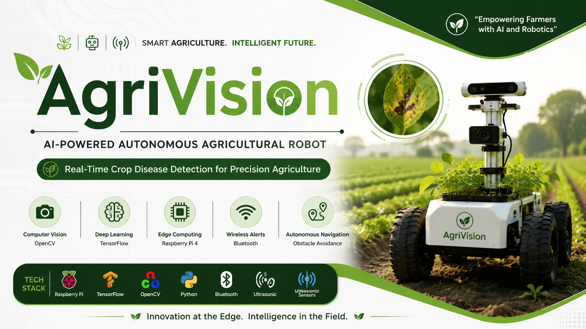
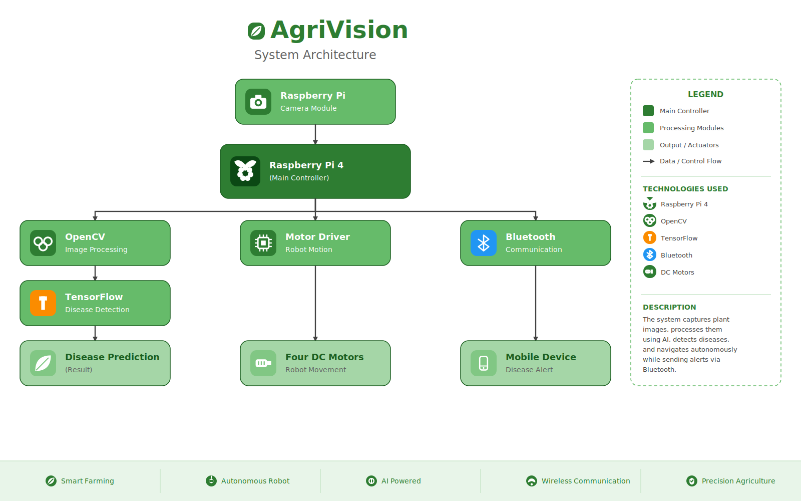
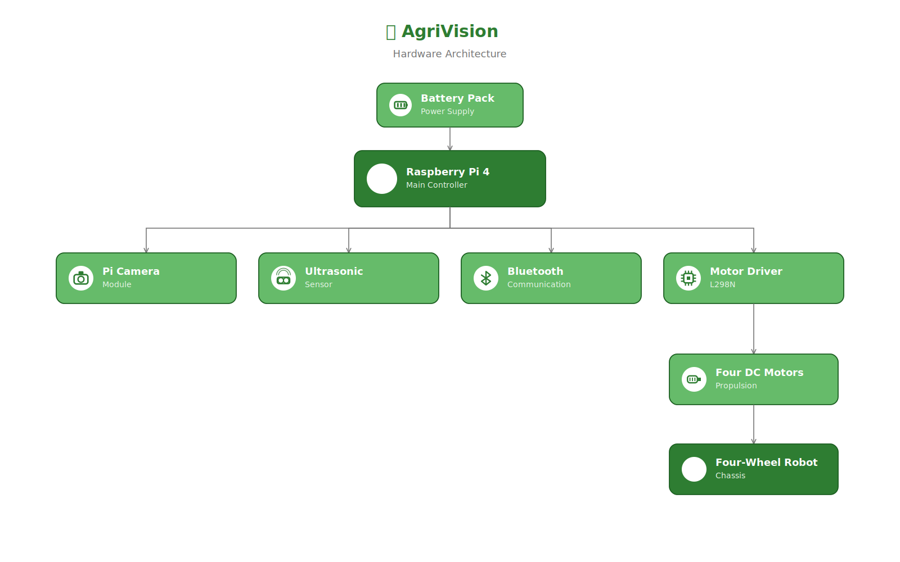
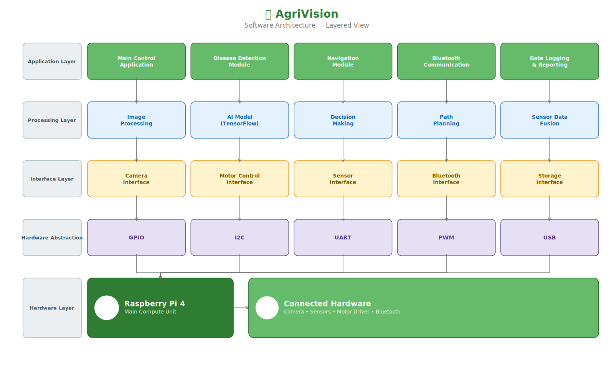
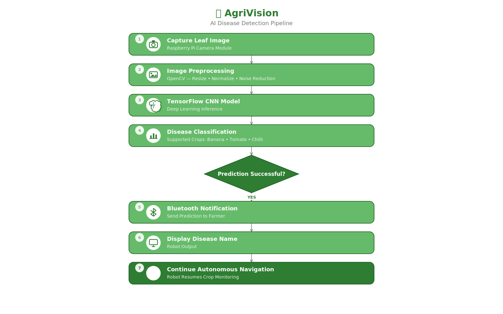
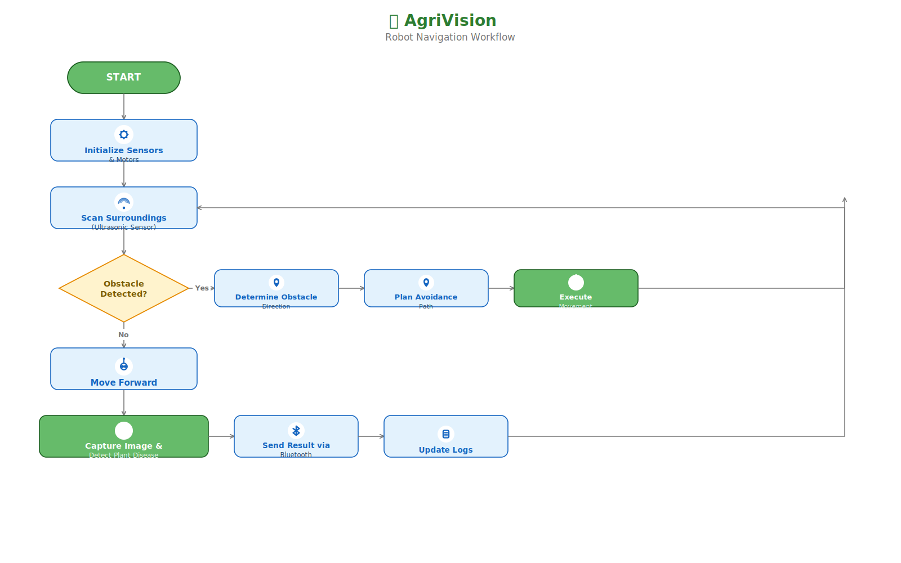
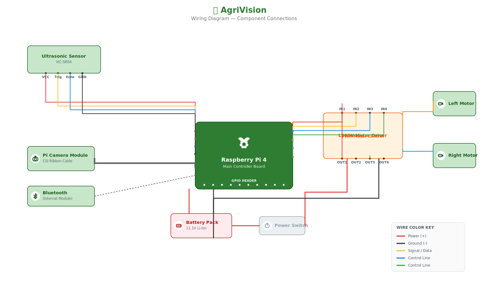
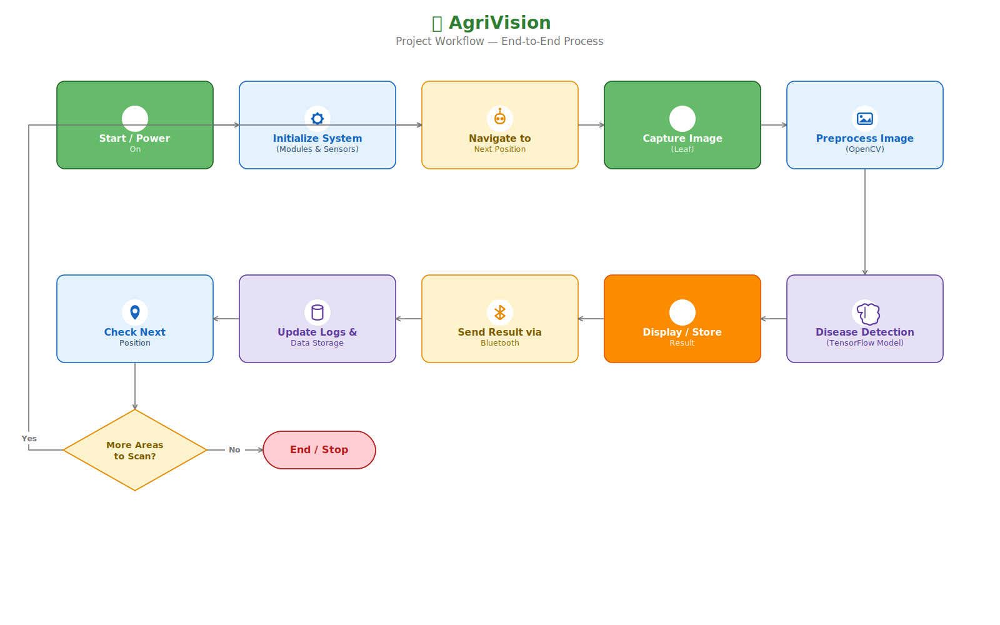

<p align="center">
  
</p>


<div align="center">

# 🌱 AgriVision

### AI-Powered Autonomous Agricultural Robot for Plant Disease Detection

> *An autonomous four-wheel agricultural robot powered by Raspberry Pi 4, TensorFlow, and OpenCV for real-time plant disease detection and smart crop monitoring.*

<br>


</div>

---

## 📑 Table of Contents

- [Project Overview](#project-overview)
- [Key Features](#key-features)
- [Hardware Components](#hardware-components)
- [Software Stack](#software-stack)
- [Repository Structure](#repository-structure)
- [System Architecture](#system-architecture)
- [Hardware Architecture](#hardware-architecture)
- [AI Disease Detection Pipeline](#ai-disease-detection-pipeline)
- [Installation](#installation)
- [Future Improvements](#future-improvements)
- [License](#license)

## 📖 Project Overview

Agriculture plays a vital role in global food production, yet plant diseases continue to cause significant crop losses due to delayed identification and manual inspection. Traditional disease monitoring methods are labor-intensive, time-consuming, and often require expert knowledge, making them unsuitable for large-scale farms.

**AgriVision** is an AI-powered autonomous agricultural robot designed to assist farmers in early plant disease detection. The robot autonomously navigates through crop fields, captures images of plant leaves using a Raspberry Pi Camera Module, processes the images using OpenCV, and classifies diseases with a TensorFlow deep learning model trained on a Kaggle plant disease dataset.

The robot supports disease detection for **banana, chilli, and tomato crops** while simultaneously avoiding obstacles and transmitting detection results wirelessly through the Raspberry Pi's built-in Bluetooth module. By combining robotics, embedded systems, computer vision, and artificial intelligence, the project demonstrates how modern technologies can contribute to precision agriculture and sustainable farming.


## 🎯 Problem Statement

Plant diseases significantly reduce agricultural productivity worldwide. Farmers often rely on manual inspection, which is time-consuming, labor-intensive, and prone to delayed diagnosis. The absence of continuous monitoring makes it difficult to identify diseases during their early stages.

There is a growing need for an intelligent autonomous system capable of continuously monitoring crops, identifying diseases in real time, and assisting farmers in making timely decisions.

This project addresses these challenges by developing an AI-powered autonomous agricultural robot capable of performing real-time disease detection while navigating through crop fields.


## 🎯 Objectives

- Develop an autonomous four-wheel mobile robot for agricultural field monitoring.
- Capture real-time crop images using the Raspberry Pi Camera Module.
- Detect plant diseases using TensorFlow and OpenCV.
- Support disease identification for banana, chilli, and tomato plants.
- Navigate autonomously while avoiding field obstacles.
- Wirelessly transmit disease detection results through Bluetooth.
- Demonstrate the integration of robotics and artificial intelligence for precision agriculture.


## ✨ Features

- 🤖 Autonomous four-wheel robot navigation
- 📷 Real-time image acquisition using Raspberry Pi Camera Module
- 🧠 TensorFlow-based deep learning model for disease classification
- 🌿 Multi-crop disease detection (Banana, Chilli, Tomato)
- 👁 Image preprocessing using OpenCV
- 🚧 Obstacle detection and avoidance
- 📲 Bluetooth-based wireless communication
- 🔋 Battery-powered portable operation
- 🛠 Modular software architecture for future scalability


---

---

# 🏗️ System Architecture

The following diagram illustrates the complete system architecture of **AgriVision**, showing how the Raspberry Pi coordinates image acquisition, AI-based disease detection, robot navigation, and Bluetooth communication.

<p align="center">
  
</p>

---

# 🔩 Hardware Architecture

<p align="center">
  
</p>

---

# 💻 Software Architecture

<p align="center">
  
</p>

---

# 🧠 AI Disease Detection Pipeline

<p align="center">
  
</p>

---

# 🚗 Robot Navigation Workflow

<p align="center">
  
</p>

---

# 🔌 Wiring Diagram

<p align="center">
  
</p>

---

# 🔄 Complete Project Workflow

<p align="center">
  
</p>

The Raspberry Pi 4 serves as the central controller of the robot. Images captured using the Raspberry Pi Camera Module are processed using OpenCV before being classified by a TensorFlow deep learning model. Based on the prediction results, the robot can notify the user through Bluetooth while continuing autonomous navigation.


# 💻 Tech Stack

| Category | Technologies |
|-----------|--------------|
| Programming Language | Python |
| AI Framework | TensorFlow |
| Computer Vision | OpenCV |
| Hardware Platform | Raspberry Pi 4 |
| Communication | Bluetooth |
| Operating System | Raspberry Pi OS |
| Mechanical System | Four-Wheel Differential Drive Robot |
| Dataset | Kaggle Plant Disease Dataset |


# 🔩 Hardware Components

The robot consists of commercially available hardware components that work together to perform autonomous navigation and AI-based disease detection.

| Component | Description |
|-----------|-------------|
| Raspberry Pi 4 | Main processing unit responsible for robot control and AI inference |
| Raspberry Pi Camera Module | Captures high-resolution images of crop leaves |
| Four DC Gear Motors | Provides robot locomotion |
| Motor Driver Module | Controls motor direction and speed |
| Ultrasonic Sensor | Detects obstacles during navigation |
| Bluetooth (Built-in) | Enables wireless communication with mobile devices |
| Battery Pack | Supplies power to the complete robot |
| Four-Wheel Chassis | Mechanical platform supporting all hardware components |

---

The following diagram illustrates the hardware components used in AgriVision and their interconnections. The Raspberry Pi 4 acts as the central controller, interfacing with the camera module, ultrasonic sensor, Bluetooth communication, and motor driver to enable autonomous navigation and AI-based disease detection.

<p align="center">
  
</p>

The modular hardware design allows easy maintenance and future expansion. Additional sensors or communication modules can be integrated without significant changes to the existing architecture.


---

# 🧠 AI Disease Detection Pipeline

The following pipeline illustrates how AgriVision processes crop images to identify plant diseases using deep learning. Images captured by the Raspberry Pi Camera Module undergo preprocessing with OpenCV before being analyzed by a TensorFlow Convolutional Neural Network (CNN). The predicted disease is then communicated to the user while the robot continues autonomous field monitoring.

<p align="center">
  
</p>

The deep learning model was trained using a Kaggle plant disease dataset and supports disease classification for **banana, tomato, and chilli** crops. The modular pipeline allows future integration of additional crop species and improved classification models.


# 💻 Software Stack

The software architecture combines computer vision, artificial intelligence, robotics, and embedded programming to perform autonomous crop monitoring.

| Software | Purpose |
|----------|---------|
| Python | Primary programming language |
| Raspberry Pi OS | Operating System |
| OpenCV | Image acquisition and preprocessing |
| TensorFlow | Plant disease classification |
| NumPy | Numerical computations |
| Git & GitHub | Version control |
| VS Code | Development environment |


---

# ⚙️ Project Workflow

The overall execution of the robot follows the workflow shown below.

```text
Start Robot
     │
     ▼
Initialize Raspberry Pi
     │
     ▼
Initialize Camera
     │
     ▼
Initialize Bluetooth
     │
     ▼
Start Autonomous Navigation
     │
     ▼
Capture Plant Image
     │
     ▼
Image Preprocessing (OpenCV)
     │
     ▼
Disease Prediction (TensorFlow)
     │
     ▼
Healthy Plant?
 ┌───────────────┐
 │               │
 │ YES           │ NO
 │               │
 ▼               ▼
Continue     Display Disease
Navigation       │
                 ▼
        Send Bluetooth Alert
                 │
                 ▼
        Continue Navigation
```


